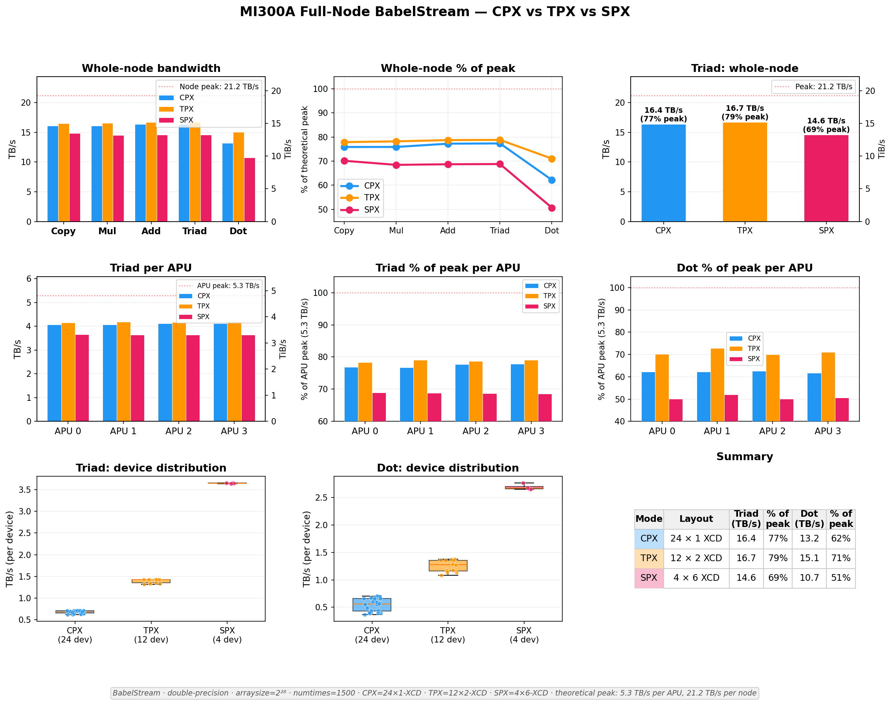

# MI300A BabelStream: CPX vs TPX vs SPX

BabelStream memory bandwidth benchmarks on AMD MI300A under different partition modes (CPX, TPX, SPX) on the Hunter cluster.



## Repository Structure

- `0XX_test_*.sh` -- experiment scripts for each configuration
- `plotting/` -- matplotlib scripts that produce the figures (data is embedded directly in each script)
- `figures/` -- output PNGs from the plotting scripts
- `reporting/` -- summary report (docx) and presentation (pptx)

## Notes on Data and Reporting

- Run outputs were manually pasted into Claude and the plotting scripts were generated from those results. A subset of values were spot-checked against manual calculations and appeared correct; a full audit was not performed but no parsing errors are suspected.
- The report and presentation in `reporting/` were summarized by Claude. There may be subtle interpretation errors, but the raw data tables speak for themselves.

## BabelStream Build (Hunter)

```bash
git clone https://github.com/UoB-HPC/BabelStream
cd BabelStream
git checkout 2f00dfb7f8b7cfe8c53d20d5c770bccbf8673440
cmake -B build -DMODEL=hip -DCMAKE_CXX_COMPILER=hipcc
cmake --build build
```
## More Metadata about experiment setting

All runs are under are done under the following setting:

```
BabelStream
Version: 5.0
Implementation: HIP
Running kernels 1500 times
Precision: double
Array size: 2147.5 MB (=2.1 GB)
Total size: 6442.5 MB (=6.4 GB)
Using HIP device AMD Instinct MI300A
Driver: 60342134
Memory: DEFAULT
```

Except for experiment 3, where we got double the array size. `numtimes` is tuned down to take 60 +- 5 seconds:

```
Running kernels 600 times
Array size: 4295.0 MB (=4.3 GB)
Total size: 12884.9 MB (=12.9 GB)
```