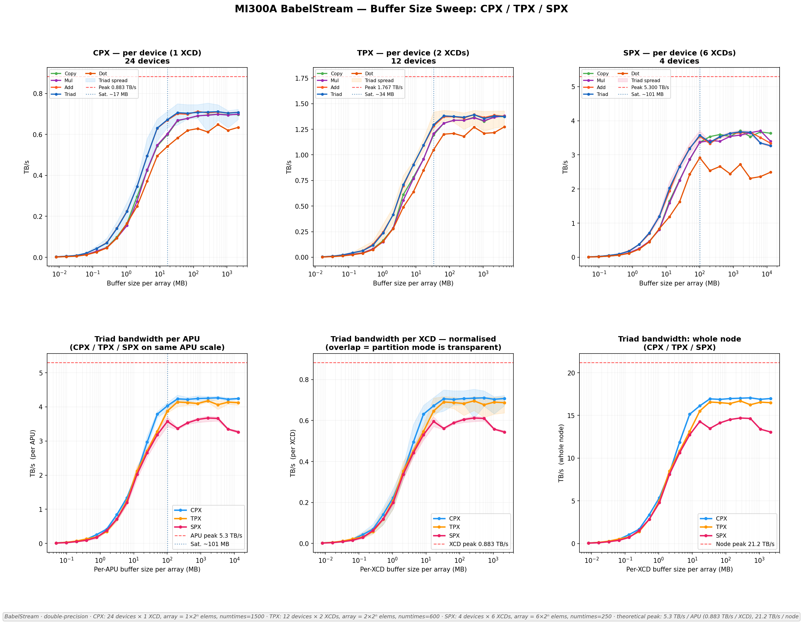
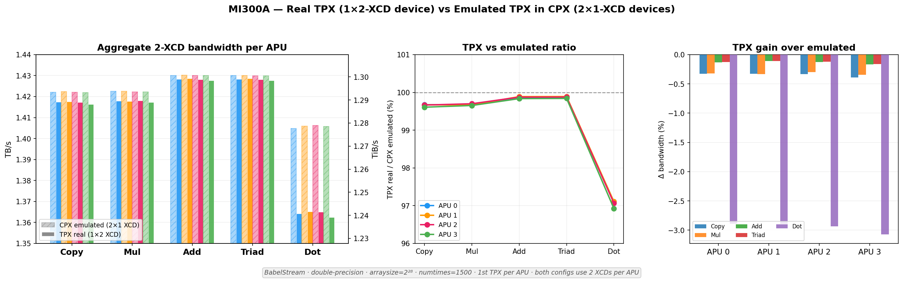
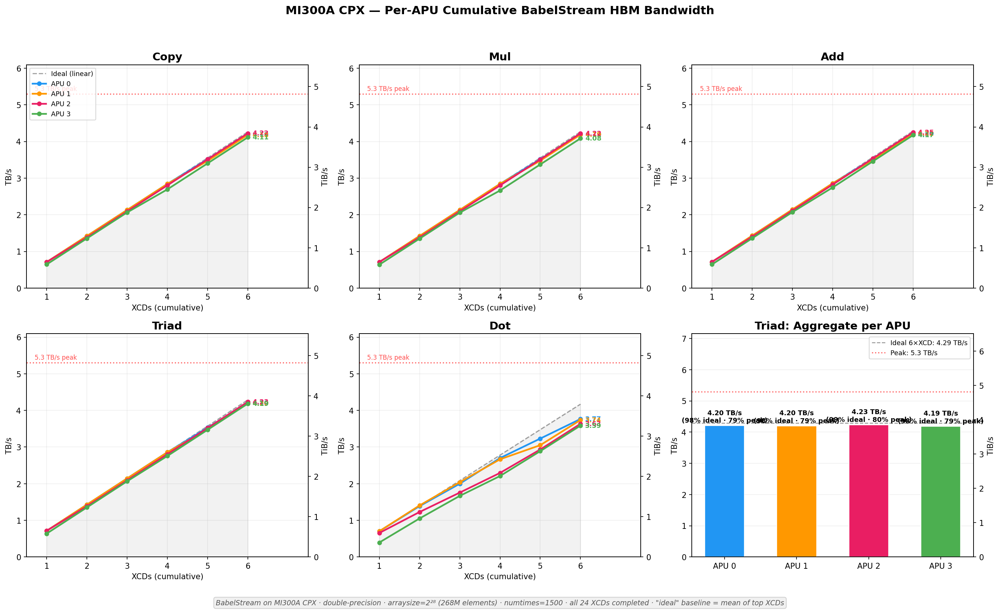
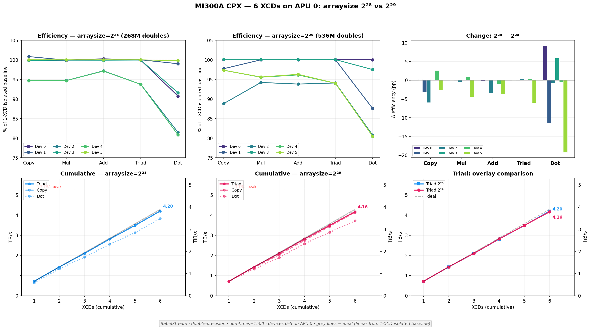
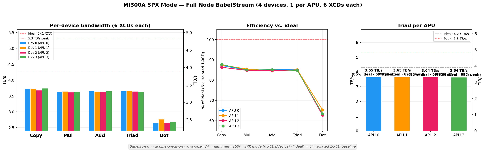
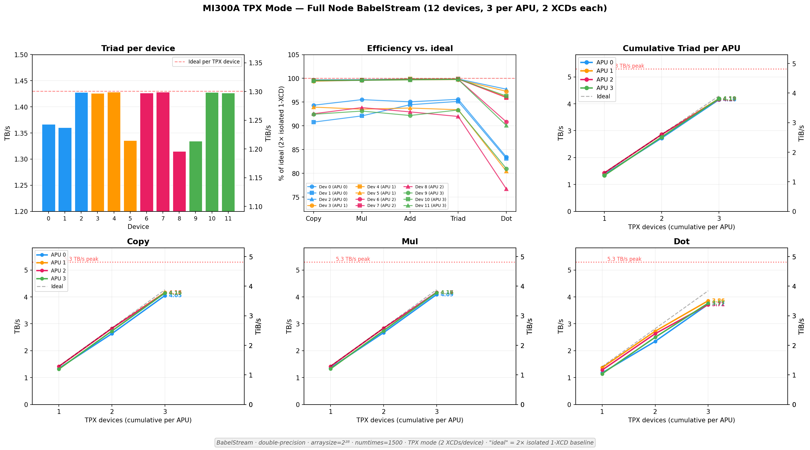

# How Partition Modes Shape Memory Bandwidth on AMD MI300A: A BabelStream Study

Memory bandwidth is the silent bottleneck behind much of GPU computing. Matrix multiplications, stencil computations, reductions -- all ultimately funnel through the memory bus. And on a chip as architecturally novel as the AMD Instinct MI300A, how you *partition* the hardware can shift throughput by double-digit percentages.

We ran [BabelStream](https://github.com/UoB-HPC/BabelStream), the standard HBM bandwidth benchmark, across all three MI300A partition modes -- CPX, TPX, and SPX -- on HLRS's [Hunter](https://www.hlrs.de/solutions/systems/hpe-amd-cluster) supercomputer. The result surprised us: the "smallest" device configuration delivered the highest whole-node bandwidth. CPX mode, where every XCD operates as its own independent device, reached **78% of theoretical peak** for the Triad kernel. TPX came in at 70%, and SPX at 63%.

This post walks through why.

---

## Inside the MI300A: Chiplets, XCDs, and HBM3

The MI300A is AMD's APU (Accelerated Processing Unit) for HPC -- it fuses CPU and GPU silicon on the same package. Each MI300A node on Hunter contains **four APUs**. Each APU houses:

- **6 XCDs** (Accelerated Compute Dies) -- these are the CDNA 3 GPU chiplets that execute your kernels
- **CPU chiplets** (Zen 4) sharing the same package
- **8 HBM3 memory stacks**, providing a theoretical peak of **5.3 TB/s** of memory bandwidth per APU

With four APUs per node, the total theoretical bandwidth is **21.2 TB/s** per node.

### A quick note on MI300X vs MI300A

The MI300X is the pure-GPU sibling. It packs **8 XCDs** into a single device (no CPU cores) with the same 8 HBM3 stacks, also rated at 5.3 TB/s. The MI300A trades two of those XCDs for integrated CPU chiplets -- giving up some raw GPU compute in exchange for unified CPU-GPU memory and tighter coupling. For bandwidth-bound workloads, the key difference is that MI300A has 6 XCDs competing for the same HBM bandwidth that MI300X distributes across 8. This actually gives MI300A a *higher bandwidth-per-XCD ratio* (0.883 TB/s vs 0.663 TB/s), which becomes relevant when we talk about partition modes.

---

## The Three Partition Modes: CPX, TPX, SPX

The MI300A lets you choose how to group XCDs into GPU devices. This is a BIOS-level setting that determines what the OS and ROCm runtime see:

| Mode | Devices per APU | XCDs per device | Total devices (node) | Character |
|------|:-:|:-:|:-:|-----------|
| **CPX** | 6 | 1 | 24 | Maximum parallelism -- each XCD is its own device |
| **TPX** | 3 | 2 | 12 | Middle ground -- pairs of XCDs form each device |
| **SPX** | 1 | 6 | 4  | Maximum device size -- one device per APU |

In **CPX mode**, the system exposes 24 independent GPU devices. Each has its own memory space, its own scheduler, and its own slice of HBM bandwidth. From the programmer's perspective, it's like having 24 small GPUs.

In **SPX mode**, you see only 4 large devices. Each device commands all 6 XCDs on its APU, with a unified address space and a single command queue. It's the simplest mental model: one device per APU.

**TPX mode** splits the difference: 2 XCDs per device, 12 devices total.

The question is: does grouping more XCDs into a single device help or hurt memory bandwidth?

---

## BabelStream: Measuring What Matters

[BabelStream](https://github.com/UoB-HPC/BabelStream) is a GPU memory bandwidth benchmark maintained by the University of Bristol. It measures achievable bandwidth using five kernels over large arrays of double-precision floats:

| Kernel | Operation | Bytes per element |
|--------|-----------|:-:|
| **Copy** | `c[i] = a[i]` | 16 (read + write) |
| **Mul**  | `b[i] = scalar * c[i]` | 16 |
| **Add**  | `c[i] = a[i] + b[i]` | 24 (2 reads + 1 write) |
| **Triad** | `a[i] = b[i] + scalar * c[i]` | 24 |
| **Dot**  | `sum += a[i] * b[i]` | 16 (+ reduction) |

Triad is the traditional STREAM benchmark kernel and is the standard measure of sustained memory bandwidth. Dot is the only kernel that involves a **reduction** -- accumulating results across all threads -- which makes it sensitive to inter-XCD communication.

We built BabelStream v5.0 with the HIP backend:

```bash
git clone https://github.com/UoB-HPC/BabelStream
cd BabelStream
cmake -B build -DMODEL=hip -DCMAKE_CXX_COMPILER=hipcc
cmake --build build
```

---

## Experimental Approach

### Parallel launch across all devices

Each experiment launches BabelStream on every visible device in parallel, using `HIP_VISIBLE_DEVICES` to pin each instance to a specific device. Here's the CPX full-node script (`000_test_cpx_full_node.sh`), which runs 24 instances simultaneously:

```bash
#!/bin/bash
OUTDIR=logs/000
mkdir -p $OUTDIR

for i in $(seq 0 23); do
  HIP_VISIBLE_DEVICES=$i ./hip-stream \
    --arraysize 268435456 \
    --numtimes 1500 \
    > $OUTDIR/device_${i}.txt 2>&1 &
done
wait
```

For TPX (12 devices) and SPX (4 devices), the loop bounds change accordingly. The `--arraysize 268435456` sets each array to 2^28 doubles (~2 GB per array, ~6 GB total memory footprint per device).

### Normalizing array sizes for fair comparison

A fair cross-mode comparison requires that each XCD processes the same amount of data. Since a TPX device bundles 2 XCDs and an SPX device bundles 6, we scale the array size proportionally:

- **CPX:** `--arraysize 268435456` (2^28 elements = 2,148 MB per array)
- **TPX:** `--arraysize 536870912` (2 x 2^28 = 4,295 MB per array)
- **SPX:** `--arraysize 1610612736` (6 x 2^28 = 12,885 MB per array)

This ensures each XCD, regardless of partition mode, gets 2^28 elements of work.

### Calibrating run duration

Benchmark duration matters. Too short, and startup noise dominates. Too long, and you waste cluster time. We wrote a script (`find_numtimes.sh`) that uses iterative extrapolation to find the `--numtimes` parameter that yields approximately 60 seconds of runtime:

```bash
#!/bin/bash
# find_numtimes.sh - discover the --numtimes that makes BabelStream run ~60s
TARGET_SECS=65
TOLERANCE=5

run_bench() {
    local nt=$1
    start=$(date +%s.%N)
    HIP_VISIBLE_DEVICES=0 ./hip-stream --arraysize 268435456 --numtimes "$nt" > /dev/null 2>&1
    end=$(date +%s.%N)
    echo "$end - $start" | bc
}

NT=600
DUR=$(run_bench $NT)

for i in $(seq 1 8); do
    NT_NEW=$(echo "$NT * $TARGET_SECS / $DUR" | bc)
    DUR=$(run_bench "$NT_NEW")
    NT=$NT_NEW

    DIFF=$(echo "$DUR - $TARGET_SECS" | bc)
    ABS_DIFF=${DIFF#-}
    if [ "$(echo "$ABS_DIFF <= $TOLERANCE" | bc)" -eq 1 ]; then
        echo "FOUND: numtimes=$NT gives ${DUR}s"
        exit 0
    fi
done
```

The idea is simple: run a probe, measure wall-clock time, linearly extrapolate to the target, and repeat until convergence. This landed us at `numtimes=1500` for the standard 2 GB array (CPX/TPX) and proportionally lower values for larger arrays (e.g., `numtimes=600` for 4 GB in TPX, `numtimes=250` for ~13 GB in SPX).

---

## Results: The Buffer Size Sweep

Before jumping to the headline numbers, it helps to understand how bandwidth evolves as a function of problem size. We swept buffer sizes from kilobytes to gigabytes across all three modes.



### The top row: per-device bandwidth curves

Each panel shows per-device bandwidth vs. buffer size for one partition mode. The classic S-curve shape is visible: bandwidth starts low (limited by launch overhead and caches), ramps steeply, and saturates once the working set exceeds the HBM's effective reach.

**Saturation points** are around **100 MB per array** for CPX and roughly **130 MB** for TPX and SPX. All of our full-node experiments use array sizes well above these thresholds (2+ GB), ensuring we are measuring steady-state HBM bandwidth, not cache effects.

The per-device peak Triad bandwidth scales roughly proportionally to XCDs per device:
- CPX (1 XCD): ~0.71 TB/s per device
- TPX (2 XCDs): ~1.35 TB/s per device
- SPX (6 XCDs): ~3.65 TB/s per device

### The bottom row: where it gets interesting

The bottom-center panel normalizes bandwidth **per XCD** and plots it against per-XCD buffer size. This is the key chart. The three mode curves **nearly overlap**, meaning that at the individual-XCD level, the silicon delivers similar bandwidth regardless of whether it's operating as an independent device (CPX), part of a pair (TPX), or part of a group of six (SPX).

But "nearly" isn't "exactly." The bottom-left panel shows **per-APU Triad bandwidth** on a common scale, and here the modes separate clearly: CPX sits highest, TPX in the middle, SPX at the bottom. Small per-XCD differences, when multiplied by 6 XCDs per APU and 4 APUs per node, compound into a significant gap.

The bottom-right panel shows the **whole-node** view -- the sum of all XCDs -- confirming that CPX consistently achieves the highest aggregate bandwidth.

---

## Head-to-Head: CPX vs TPX vs SPX

Now for the main comparison. Here we ran all devices simultaneously on the full node, with **normalized array sizes** (each XCD processes 2^28 elements):


### The headline numbers

| Mode | Layout | Array (MB) | Triad (TB/s) | % of peak | Dot (TB/s) | % of peak |
|------|--------|:--:|:--:|:--:|:--:|:--:|
| **CPX** | 24 x 1 XCD | 2,148 | **16.5** | **78%** | **13.6** | **64%** |
| **TPX** | 12 x 2 XCD | 4,295 | 14.8 | 70% | 11.8 | 55% |
| **SPX** | 4 x 6 XCD | 12,885 | 13.3 | 63% | 10.0 | 47% |

CPX delivers **16.5 TB/s** of Triad bandwidth -- 78% of the 21.2 TB/s theoretical peak. TPX trails by 11%, and SPX trails by 19%.

### Per-APU consistency

The per-APU Triad chart (middle-left panel) shows another advantage of CPX: all four APUs deliver nearly identical bandwidth (~4.1 TB/s each). TPX and SPX show similar uniformity, but at lower absolute values (~3.7 and ~3.3 TB/s respectively).

### The Dot penalty

Dot is the outlier among the five kernels. It's the only one involving a **reduction**, which requires inter-thread and (in multi-XCD configurations) inter-XCD communication. This communication overhead hits SPX hardest: its Dot performance drops to just **47% of peak**, compared to 64% for CPX. The right side of the figure shows this clearly -- the percentage-of-peak curves for all modes dip sharply at Dot, but SPX dips the furthest.

This makes intuitive sense. A Dot reduction on an SPX device must aggregate partial sums across 6 XCDs. In CPX mode, each device's Dot reduction happens entirely within a single XCD -- no cross-die communication needed.

---

## Why Does CPX Win?

The fundamental answer is **coordination overhead**.

In CPX mode, all 24 XCDs run as independent devices. Each XCD has its own command queue, its own scheduler, and generates its own memory requests into its slice of the HBM subsystem. There is no synchronization between devices. Each stream of memory requests saturates its own path through the memory controller without interference from other XCDs.

In TPX and SPX modes, the HIP runtime must coordinate multiple XCDs within a single device:

1. **Work distribution:** The runtime must partition kernel launches across XCDs within the device
2. **Address space unification:** All XCDs in a device share a single virtual address space, requiring coordination in the memory management layer
3. **Implicit synchronization:** Kernel completion and memory ordering guarantees across XCDs within a device add overhead
4. **Reduction across dies:** Operations like Dot require cross-XCD communication within the device

None of this overhead exists in CPX mode, where each XCD is blissfully unaware of the others.

### Confirmation: emulated TPX vs real TPX

One of our earlier experiments nailed this down. We ran BabelStream on two *adjacent* CPX devices on the same APU -- effectively "emulating" a TPX configuration with 2 XCDs of compute power, but without any inter-XCD device coordination. Then we compared that against real TPX mode (a single 2-XCD device).



The result: real TPX was **1-3% slower** than the emulated version for streaming kernels, and the gap widened for Dot (the reduction kernel). The hardware is identical in both cases -- same XCDs, same HBM, same APU. The only difference is whether the runtime treats them as one device or two. That runtime coordination is where the bandwidth goes.

---

## For the Curious: Deep Dive Experiments

The results above tell the main story. But we ran several additional experiments along the way that shed light on specific aspects of MI300A behavior. Here's a quick tour.

### CPX scaling linearity

Before comparing modes, we characterized CPX in isolation. The question: does bandwidth scale linearly as you activate more XCDs on a single APU?



Mostly yes. The cumulative Triad bandwidth per APU climbs nearly linearly from 1 to 5 XCDs, with a slight flattening at 6. All four APUs reach around **4.2 TB/s aggregate Triad** (79% of the 5.3 TB/s per-APU peak). The near-linearity confirms that the HBM subsystem is not becoming the bottleneck at 6 XCDs -- there's still headroom in the memory controller.

The Dot kernel tells a slightly different story: scaling is also near-linear, but the absolute efficiency per XCD is lower, and variance across XCDs is wider. Some XCDs consistently underperform on Dot while matching others on streaming kernels, suggesting non-uniform internal topology effects.

### Array size sensitivity

Does doubling the array size change anything? We tested this on a single APU in CPX mode, comparing 2^28 (2 GB) and 2^29 (4 GB) arrays.



The result: minimal difference for streaming kernels (within 1%), but Dot showed a **5-15% drop** with larger arrays on some devices. This is expected -- larger arrays mean more data to reduce, amplifying the cost of the final accumulation step. For streaming kernels (Copy, Mul, Add, Triad), once you're above the saturation threshold (~100 MB), array size matters very little.

### SPX: uniform but lower

SPX mode provides the simplest device model -- just 4 big devices. The payoff is programming simplicity. The cost is bandwidth.



Each SPX device reaches about **3.65 TB/s for Triad** (69% of per-APU peak), impressively uniform across all four APUs. But the efficiency vs. ideal (6x isolated XCD) drops to 85% for streaming kernels and plummets to around 60% for Dot. The 6-XCD coordination tax is real and consistent.

### TPX: the middle ground

TPX mode shows intermediate behavior. With 3 devices per APU (each pairing 2 XCDs), TPX inherits some coordination overhead from intra-device XCD pairing, but far less than SPX's 6-XCD grouping.



Per-device Triad ranges from 1.32 to 1.43 TB/s across the 12 devices, with more variance than either CPX or SPX. The cumulative per-APU bandwidth reaches about **4.1-4.2 TB/s**, which is close to CPX's level -- the 2-XCD coordination overhead is modest. This makes TPX an appealing middle ground for workloads that benefit from slightly larger device memory but can't tolerate SPX's bandwidth loss.

---

## Key Takeaways

**1. CPX mode maximizes memory bandwidth.** At 78% of theoretical peak (16.5 TB/s whole-node Triad), CPX outperforms TPX by 11% and SPX by 19%. If your workload is bandwidth-bound and can manage 24 independent device instances, CPX is the clear choice.

**2. The overhead is from software coordination, not hardware.** The per-XCD silicon delivers similar bandwidth in all modes. The difference comes from the runtime overhead of coordinating multiple XCDs within a single device -- work distribution, synchronization, and unified address space management.

**3. Reduction operations suffer most.** The Dot kernel, which requires cross-XCD communication for the reduction step, shows the largest mode sensitivity. SPX Dot reaches only 47% of peak, versus 64% for CPX. Workloads heavy in reductions or all-reduce patterns will see the biggest benefit from CPX.

**4. SPX trades bandwidth for simplicity.** SPX's 4-device model is the easiest to program and reason about. For workloads that aren't bandwidth-bound (compute-heavy kernels, for instance), SPX's simplicity may outweigh the bandwidth penalty. But for memory-bound codes, the 15 percentage-point gap vs. CPX is substantial.

**5. Array size normalization matters.** When comparing modes, scaling the array size proportionally to XCDs per device (so each XCD processes the same data) gives the fairest comparison. With a fixed (un-normalized) array size, TPX can actually *match* CPX because fewer elements per XCD create a different operating point. The "right" comparison depends on whether your workload's problem size scales with device count.

---

*All experiments were performed on the HLRS Hunter supercomputer (AMD MI300A nodes). BabelStream v5.0 with the HIP backend, double precision. The full set of experiment scripts and plotting code is available in [the repository](https://github.com/hpckkuec/mi300a_babelstream_cpx_tpx_spx).*
