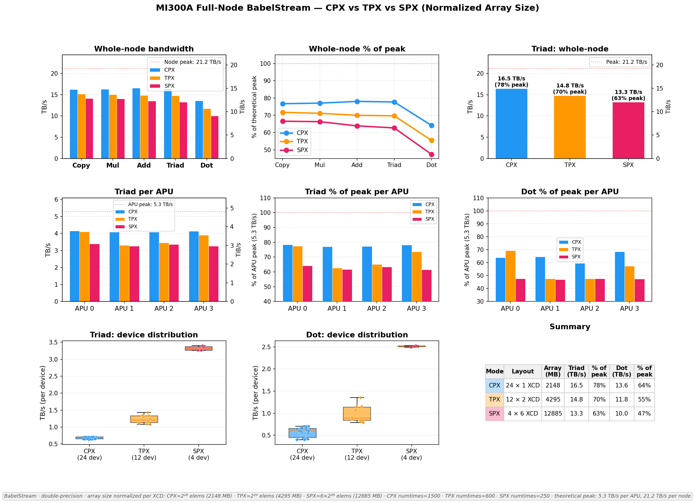

# How Partition Modes Shape Memory Bandwidth on AMD MI300A: A BabelStream Study

Memory bandwidth is the silent bottleneck behind much of GPU computing. Matrix multiplications, stencil computations, reductions -- all ultimately funnel through the memory bus. And on a chip as architecturally novel as the AMD Instinct MI300A, how you *partition* the hardware can shift throughput by double-digit percentages.

We ran [BabelStream](https://github.com/UoB-HPC/BabelStream), the standard HBM bandwidth benchmark, across all three MI300A partition modes -- CPX, TPX, and SPX -- on HLRS's [Hunter](https://www.hlrs.de/solutions/systems/hpe-amd-cluster) supercomputer. The result surprised us: the "smallest" device configuration delivered the highest whole-node bandwidth. CPX mode, where every XCD operates as its own independent device, reached **78% of theoretical peak** for the Triad kernel. TPX came in at 70%, and SPX at 63%.

This post walks through why.

---

## Inside the MI300A: Chiplets, XCDs, and HBM3

The MI300A is AMD's APU (Accelerated Processing Unit) for HPC -- it fuses CPU and GPU silicon on the same package. Each MI300A node on Hunter contains **four APUs**. Each APU houses:

- **6 XCDs** (Accelerated Compute Dies) -- these are the CDNA 3 GPU chiplets that execute your kernels
- **CPU chiplets** (Zen 4) sharing the same package
- **8 HBM3 memory stacks**, providing a theoretical peak of **5.3 TB/s** of memory bandwidth per APU

With four APUs per node, the total theoretical bandwidth is **21.2 TB/s** per node.

### A quick note on MI300X vs MI300A

The MI300X is the pure-GPU sibling. It packs **8 XCDs** into a single device (no CPU cores) with the same 8 HBM3 stacks, also rated at 5.3 TB/s. The MI300A trades two of those XCDs for integrated CPU chiplets -- giving up some raw GPU compute in exchange for unified CPU-GPU memory and tighter coupling. For bandwidth-bound workloads, the key difference is that MI300A has 6 XCDs competing for the same HBM bandwidth that MI300X distributes across 8. This actually gives MI300A a *higher bandwidth-per-XCD ratio* (0.883 TB/s vs 0.663 TB/s), which becomes relevant when we talk about partition modes.

---

## The Three Partition Modes: CPX, TPX, SPX

The MI300A lets you choose how to group XCDs into GPU devices. This is a BIOS-level setting that determines what the OS and ROCm runtime see:

| Mode | Devices per APU | XCDs per device | Total devices (node) | Character |
|------|:-:|:-:|:-:|-----------|
| **CPX** | 6 | 1 | 24 | Maximum parallelism -- each XCD is its own device |
| **TPX** | 3 | 2 | 12 | Middle ground -- pairs of XCDs form each device |
| **SPX** | 1 | 6 | 4  | Maximum device size -- one device per APU |

In **CPX mode**, the system exposes 24 independent GPU devices. Each has its own memory space, its own scheduler, and its own slice of HBM bandwidth. From the programmer's perspective, it's like having 24 small GPUs.

In **SPX mode**, you see only 4 large devices. Each device commands all 6 XCDs on its APU, with a unified address space and a single command queue. It's the simplest mental model: one device per APU.

**TPX mode** splits the difference: 2 XCDs per device, 12 devices total.

The question is: does grouping more XCDs into a single device help or hurt memory bandwidth?

---

## BabelStream: Measuring What Matters

[BabelStream](https://github.com/UoB-HPC/BabelStream) is a GPU memory bandwidth benchmark maintained by the University of Bristol. It measures achievable bandwidth using five kernels over large arrays of double-precision floats:

| Kernel | Operation | Bytes per element |
|--------|-----------|:-:|
| **Copy** | `c[i] = a[i]` | 16 (read + write) |
| **Mul**  | `b[i] = scalar * c[i]` | 16 |
| **Add**  | `c[i] = a[i] + b[i]` | 24 (2 reads + 1 write) |
| **Triad** | `a[i] = b[i] + scalar * c[i]` | 24 |
| **Dot**  | `sum += a[i] * b[i]` | 16 (+ reduction) |

Triad is the traditional STREAM benchmark kernel and is the standard measure of sustained memory bandwidth. Dot is the only kernel that involves a **reduction** -- accumulating results across all threads -- which makes it sensitive to inter-XCD communication.

An important caveat: BabelStream measures **achievable HBM bandwidth** using pure streaming access patterns. It doesn't capture compute-bound behavior, non-trivial memory access patterns, inter-device communication (MPI/RCCL), or kernel launch overhead. Our results tell you how much bandwidth the hardware can deliver under ideal streaming conditions in each partition mode -- a useful ceiling for memory-bound codes, but not a direct prediction of application performance.

We built BabelStream v5.0 with the HIP backend:

```bash
git clone https://github.com/UoB-HPC/BabelStream
cd BabelStream
cmake -B build -DMODEL=hip -DCMAKE_CXX_COMPILER=hipcc
cmake --build build
```

---

## Experimental Approach

### Parallel launch across all devices

Each experiment launches BabelStream on every visible device in parallel, using `HIP_VISIBLE_DEVICES` to pin each instance to a specific device. Here's the CPX full-node script (`000_test_cpx_full_node.sh`), which runs 24 instances simultaneously:

```bash
#!/bin/bash
OUTDIR=logs/000
mkdir -p $OUTDIR

for i in $(seq 0 23); do
  HIP_VISIBLE_DEVICES=$i ./hip-stream \
    --arraysize 268435456 \
    --numtimes 1500 \
    > $OUTDIR/device_${i}.txt 2>&1 &
done
wait
```

For TPX (12 devices) and SPX (4 devices), the loop bounds change accordingly. The `--arraysize 268435456` sets each array to 2^28 doubles (~2 GB per array, ~6 GB total memory footprint per device).

### Normalizing array sizes for fair comparison

A naive approach would use the same array size for every device regardless of partition mode. But BabelStream runs independently on each device, so the total memory footprint per APU would scale with device count -- CPX (6 devices per APU) would push 6x more aggregate data through each APU's HBM than SPX (1 device). That's not a fair bandwidth comparison; it's a contention test.

Instead, we scale the array size proportionally to XCDs per device. This way, each XCD processes the same amount of data, and each APU faces the same total memory pressure (~38 GB) regardless of mode:

- **CPX:** `--arraysize 268435456` (2^28 elements = 2,148 MB per array)
- **TPX:** `--arraysize 536870912` (2 x 2^28 = 4,295 MB per array)
- **SPX:** `--arraysize 1610612736` (6 x 2^28 = 12,885 MB per array)

Now every APU services ~38.4 GB total, regardless of partition mode. The buffer size sweep (discussed below) confirms that all these array sizes sit well above the ~100 MB saturation threshold, so we're measuring steady-state HBM throughput, not cache effects.

### Calibrating run duration

Benchmark duration matters. Too short, and startup noise dominates. Too long, and you waste cluster time. We wrote a script (`find_numtimes.sh`) that uses iterative extrapolation to find the `--numtimes` parameter that yields approximately 60 seconds of runtime:

```bash
#!/bin/bash
# find_numtimes.sh - discover the --numtimes that makes BabelStream run ~60s
TARGET_SECS=65
TOLERANCE=5

run_bench() {
    local nt=$1
    start=$(date +%s.%N)
    HIP_VISIBLE_DEVICES=0 ./hip-stream --arraysize 268435456 --numtimes "$nt" > /dev/null 2>&1
    end=$(date +%s.%N)
    echo "$end - $start" | bc
}

NT=600
DUR=$(run_bench $NT)

for i in $(seq 1 8); do
    NT_NEW=$(echo "$NT * $TARGET_SECS / $DUR" | bc)
    DUR=$(run_bench "$NT_NEW")
    NT=$NT_NEW

    DIFF=$(echo "$DUR - $TARGET_SECS" | bc)
    ABS_DIFF=${DIFF#-}
    if [ "$(echo "$ABS_DIFF <= $TOLERANCE" | bc)" -eq 1 ]; then
        echo "FOUND: numtimes=$NT gives ${DUR}s"
        exit 0
    fi
done
```

The idea is simple: run a probe, measure wall-clock time, linearly extrapolate to the target, and repeat until convergence. This landed us at `numtimes=1500` for the standard 2 GB array (CPX/TPX) and proportionally lower values for larger arrays (e.g., `numtimes=600` for 4 GB in TPX, `numtimes=250` for ~13 GB in SPX).

### A note on statistical reliability

One might wonder whether single benchmark runs produce reliable numbers. BabelStream handles this internally: with `numtimes=1500`, each kernel executes 1,500 times, and the reported bandwidth is derived from the **minimum** time across all iterations (excluding the first as warmup). This is the standard [STREAM methodology](https://www.cs.virginia.edu/stream/) -- the minimum captures the best achievable throughput, filtering out OS jitter, scheduling noise, and transient interference. With 1,499 independent timing samples spread across ~60 seconds of execution, thermal variation and system state fluctuations are captured within each run. The relevant source from [`main.cpp`](https://github.com/UoB-HPC/BabelStream/blob/main/src/main.cpp):

```cpp
// Get min/max; ignore the first result
auto minmax = std::minmax_element(timings[i].begin()+1, timings[i].end());
// Bandwidth from minimum time
fmt_bw(bench[i].weight, *minmax.first);
```

---

## Results: The Buffer Size Sweep

Before jumping to the headline numbers, it helps to understand how bandwidth evolves as a function of problem size. We swept buffer sizes from kilobytes to gigabytes across all three modes.


### The top row: per-device bandwidth curves

Each panel shows per-device bandwidth vs. buffer size for one partition mode. The classic S-curve shape is visible: bandwidth starts low (limited by launch overhead and caches), ramps steeply, and saturates once the working set exceeds the HBM's effective reach.

**Saturation points** are around **100 MB per array** for CPX and roughly **130 MB** for TPX and SPX. All of our full-node experiments use array sizes well above these thresholds (2+ GB), ensuring we are measuring steady-state HBM bandwidth, not cache effects.

The per-device peak Triad bandwidth scales roughly proportionally to XCDs per device:
- CPX (1 XCD): ~0.71 TB/s per device
- TPX (2 XCDs): ~1.35 TB/s per device
- SPX (6 XCDs): ~3.65 TB/s per device

### The bottom row: where it gets interesting

The bottom-center panel normalizes bandwidth **per XCD** and plots it against per-XCD buffer size. This is the key chart. The three mode curves **nearly overlap**, meaning that at the individual-XCD level, the silicon delivers similar bandwidth regardless of whether it's operating as an independent device (CPX), part of a pair (TPX), or part of a group of six (SPX).

But "nearly" isn't "exactly." The bottom-left panel shows **per-APU Triad bandwidth** on a common scale, and here the modes separate clearly: CPX sits highest, TPX in the middle, SPX at the bottom. Small per-XCD differences, when multiplied by 6 XCDs per APU and 4 APUs per node, compound into a significant gap.

The bottom-right panel shows the **whole-node** view -- the sum of all XCDs -- confirming that CPX consistently achieves the highest aggregate bandwidth.

---

## Head-to-Head: CPX vs TPX vs SPX

Now for the main comparison. Here we ran all devices simultaneously on the full node, with **normalized array sizes** (each XCD processes 2^28 elements):



### The headline numbers

| Mode | Layout | Array (MB) | Triad (TB/s) | % of peak | Dot (TB/s) | % of peak |
|------|--------|:--:|:--:|:--:|:--:|:--:|
| **CPX** | 24 x 1 XCD | 2,148 | **16.5** | **78%** | **13.6** | **64%** |
| **TPX** | 12 x 2 XCD | 4,295 | 14.8 | 70% | 11.8 | 55% |
| **SPX** | 4 x 6 XCD | 12,885 | 13.3 | 63% | 10.0 | 47% |

CPX delivers **16.5 TB/s** of Triad bandwidth -- 78% of the 21.2 TB/s theoretical peak. TPX trails by 11%, and SPX trails by 19%.

### Per-APU consistency

The per-APU Triad chart (middle-left panel) shows another advantage of CPX: all four APUs deliver nearly identical bandwidth (~4.1 TB/s each). TPX and SPX show similar uniformity, but at lower absolute values (~3.7 and ~3.3 TB/s respectively).

### The Dot penalty

Dot is the outlier among the five kernels. It's the only one involving a **reduction**, which requires inter-thread and (in multi-XCD configurations) inter-XCD communication. This communication overhead hits SPX hardest: its Dot performance drops to just **47% of peak**, compared to 64% for CPX. The right side of the figure shows this clearly -- the percentage-of-peak curves for all modes dip sharply at Dot, but SPX dips the furthest.

This makes intuitive sense. A Dot reduction on an SPX device must aggregate partial sums across 6 XCDs. In CPX mode, each device's Dot reduction happens entirely within a single XCD -- no cross-die communication needed.

---

## Why Does CPX Win?

Our working hypothesis is **coordination overhead** within multi-XCD devices.

In CPX mode, all 24 XCDs run as independent devices. Each XCD has its own command queue, its own scheduler, and generates its own memory requests into its slice of the HBM subsystem. There is no synchronization between devices.

In TPX and SPX modes, the HIP runtime must coordinate multiple XCDs within a single device. Several mechanisms could contribute to the observed bandwidth loss:

1. **Work distribution:** The runtime partitions kernel launches across XCDs within the device
2. **Address space unification:** All XCDs in a device share a single virtual address space, which may add coordination in the memory management layer
3. **Implicit synchronization:** Kernel completion and memory ordering guarantees across XCDs within a device may add overhead
4. **Reduction across dies:** Operations like Dot require cross-XCD communication within the device

None of this applies in CPX mode, where each XCD operates independently.

We should note that we have not performed low-level profiling (e.g., `rocprof` trace analysis) to confirm which of these mechanisms dominate, or whether other factors -- such as memory controller arbitration differences, TLB pressure from larger unified address spaces, or firmware-level HBM scheduling -- also play a role. What the data clearly shows is that grouping more XCDs into a single device reduces per-XCD bandwidth; the emulated TPX experiment below narrows down *where* that cost lives.

### Confirmation: emulated TPX vs real TPX

This raised a natural question: if we take CPX mode and run two XCDs on the same APU simultaneously, does that match what TPX gives us? In other words, is a TPX device just two CPX devices stapled together, or does the TPX device abstraction itself cost something?

We tested exactly this. In CPX mode, we launched BabelStream on two adjacent devices belonging to the same APU (e.g., devices 0 and 1 on APU 0) and summed their bandwidth. Then we compared that against real TPX mode running on the corresponding single 2-XCD device.


The result: real TPX was **~0.3% slower** on streaming kernels (Copy, Mul, Add, Triad) and **~2.5-3% slower on Dot** (the reduction kernel). The hardware is identical in both cases -- same XCDs, same HBM, same APU. The only difference is whether the runtime treats them as one device or two. The streaming gap is tiny, but the Dot gap is telling: each independent CPX process runs its own reduction locally, while the fused TPX device must coordinate a reduction across two XCDs internally. That cross-die coordination is where the bandwidth goes.

A side finding from this experiment is equally important: running 2 XCDs per APU in CPX mode produced **zero measurable contention** -- cross-device bandwidth spread was below 0.05% on streaming operations. The HBM controller handles two concurrent streams without breaking a sweat. Degradation only begins at 3 XCDs per APU, making 2 XCDs per APU a critical contention-onset threshold for the MI300A's memory subsystem.

---

## For the Curious: Deep Dive Experiments

The results above tell the main story. But we ran several additional experiments along the way that shed light on specific aspects of MI300A behavior. Here's a quick tour.

### CPX scaling linearity

Before comparing modes, we characterized CPX in isolation. The question: does bandwidth scale linearly as you activate more XCDs on a single APU?


Mostly yes. The cumulative Triad bandwidth per APU climbs nearly linearly from 1 to 5 XCDs, with a slight flattening at 6. All four APUs reach around **4.19-4.20 TB/s aggregate Triad** (79% of the 5.3 TB/s per-APU peak). The near-linearity confirms that the HBM subsystem is not becoming the bottleneck at 6 XCDs -- there's still headroom in the memory controller.

The Dot kernel tells a slightly different story: scaling is also near-linear, but the absolute efficiency per XCD is lower, and variance across XCDs is wider. Specific XCDs -- notably devices 2 and 4 within each APU -- consistently underperform under contention, dropping to around 95% efficiency on streaming operations and as low as 80% on Dot, while their neighbors maintain near-baseline bandwidth. This asymmetry is hardware-level and reproducible regardless of run ordering, pointing to a physical asymmetry in the HBM interconnect topology rather than a software scheduling artifact. The strong devices compensate, keeping the aggregate high.

### Array size sensitivity

Does doubling the array size change anything? We tested this on a single APU in CPX mode, comparing 2^28 (2 GB) and 2^29 (4 GB) arrays.


The aggregate Triad barely budged -- from 4.20 to 4.16 TB/s (about 1%). But the per-device picture shifted: the already-weak devices 2 and 4 degraded further (from 95% to 89% on Copy), and previously strong devices like 1 and 5 also started suffering. Devices 0 and 3 remained rock-solid at ~100% efficiency in both configurations. The Dot product gap widened more considerably, confirming that larger memory footprints increase HBM controller contention pressure. The takeaway: for streaming kernels, once you're above the saturation threshold (~100 MB), aggregate bandwidth is remarkably stable -- but the *distribution* across devices shifts as contention pressure grows.

### SPX: uniform but lower

SPX mode provides the simplest device model -- just 4 big devices. The payoff is programming simplicity. The cost is bandwidth.


Each SPX device reaches about **3.64-3.65 TB/s for Triad** (69% of per-APU peak), with all four APUs landing within 0.4% of each other -- the most uniform results of any mode. The inter-device contention variance that plagues CPX and TPX is eliminated because there's only one process per APU. But the efficiency vs. ideal (6x isolated XCD baseline) drops to 85% for streaming kernels and plummets to approximately 51% on Dot. With a single process coordinating all 6 XCDs internally, the intra-device overhead dominates. The Dot reduction across 6 XCDs within one device is far more expensive than 6 independent reductions in CPX mode.

### TPX: the middle ground

TPX mode shows intermediate behavior. With 3 devices per APU (each pairing 2 XCDs), TPX inherits some coordination overhead from intra-device XCD pairing, but far less than SPX's 6-XCD grouping.


Per-device Triad ranges from 1.32 to 1.43 TB/s across the 12 devices, with more variance than either CPX or SPX. The contention pattern mirrors CPX: the **3rd TPX device per APU** faces the most bandwidth pressure. Devices that happen to be the 3rd in their APU (e.g., device 5 on APU 1, devices 8 and 9 on APU 2) drop to 80-93% efficiency on streaming operations and as low as 77% on Dot, while the 1st and 2nd devices per APU maintain near-peak performance.

Despite this variance, the cumulative per-APU bandwidth reaches **4.10-4.19 TB/s** (77-79% of the 5.3 TB/s per-APU peak), close to CPX's level. The 2-XCD-per-device coordination overhead is modest. This makes TPX an appealing middle ground for workloads that benefit from slightly larger device memory but can't tolerate SPX's bandwidth loss.

### What if we don't normalize array sizes?

It's worth addressing this directly, since at first glance it might seem simpler to just use the same array size for all modes and compare. We ran that experiment too -- and the result initially suggested TPX was the winner. Understanding why that conclusion is misleading requires looking at what BabelStream actually does under the hood.

#### How BabelStream works: one process, one device

BabelStream is a single-process, single-device benchmark. Each instance allocates three arrays on the GPU via `hipMalloc`, then runs streaming kernels over them in a tight loop. Here's the Triad kernel from the HIP backend ([`HIPStream.cpp`](https://github.com/UoB-HPC/BabelStream/blob/main/src/hip/HIPStream.cpp)):

```cpp
__global__ void triad_kernel(T * a, const T * b, const T * c, size_t array_size) {
  const T scalar = startScalar;
  for (size_t i = threadIdx.x + blockDim.x * blockIdx.x;
       i < array_size;
       i += gridDim.x * blockDim.x) {
    a[i] = b[i] + scalar * c[i];
  }
}
```

Each kernel launch is followed by `hipDeviceSynchronize()`, and the wall-clock time is measured to compute bandwidth:

```cpp
// bandwidth = bytes_moved / minimum_time_across_iterations
auto fmt_bw = [&](size_t weight, double dt) {
  return unit.fmt((weight * sizeof(T) * array_size) / dt);
};
```

The key point: BabelStream measures **"how fast can I stream through my arrays on this one device?"** It knows nothing about other processes. It doesn't coordinate with them, share memory with them, or account for them.

#### What happens when we launch 6 processes per APU

In CPX mode, our test script launches 24 independent BabelStream processes -- one per XCD, six per APU. Each process allocates its own 3 arrays (totaling ~6.4 GB), and streams through them independently. The six processes on the same APU all compete for the same HBM bandwidth pool.

```bash
# Each of 24 iterations spawns an independent process
for i in $(seq 0 23); do
  HIP_VISIBLE_DEVICES=$i ./hip-stream --arraysize 268435456 --numtimes 1500 &
done
wait
```

When we sum the reported bandwidths to get "whole-node Triad," we're computing:

```
total_bw = sum( bytes_moved_by_process_i / time_for_process_i )  for i in 0..23
```

Now compare this with SPX mode, which launches only 4 processes (one per APU). Each SPX process gets all 6 XCDs on its APU, but still allocates the same 6.4 GB of arrays. The per-APU memory traffic looks radically different:

| Mode | BabelStream processes per APU | Arrays allocated per APU | HBM traffic per Triad sweep |
|------|:-:|:-:|:-:|
| CPX | 6 independent processes | 6 x 6.4 GB = **38.4 GB** | 6 x 6.4 GB = **38.4 GB** |
| TPX | 3 independent processes | 3 x 6.4 GB = **19.2 GB** | 3 x 6.4 GB = **19.2 GB** |
| SPX | 1 process | 1 x 6.4 GB = **6.4 GB** | 1 x 6.4 GB = **6.4 GB** |

CPX is pushing **6x** the total data through each APU's HBM controllers. We're no longer comparing "which partition mode delivers more bandwidth" -- we're comparing "how well does the HBM subsystem hold up under 6x the load." That's a congestion test, not a bandwidth test.

#### The un-normalized results

With the same 2^28-element array per device, the whole-node Triad numbers were:

| Mode | Devices | Total HBM traffic per APU | Triad (TB/s) | % of peak |
|------|:-:|:-:|:-:|:-:|
| CPX | 24 | **38.4 GB** | 16.4 | 77% |
| TPX | 12 | **19.2 GB** | 16.7 | 79% |
| SPX | 4  | **6.4 GB**  | 14.6 | 69% |

TPX edges out CPX by a slim margin. But CPX is achieving this while servicing 2x the total memory traffic of TPX and 6x that of SPX per APU. The fact that CPX still delivers 77% of peak under this asymmetric load is, if anything, evidence of how efficiently independent XCDs saturate the HBM controllers.

When we normalize array sizes (as described in the experimental setup), every APU services ~38.4 GB regardless of partition mode, and CPX's advantage becomes clear.

### How does 78% of peak compare to other GPUs?

NVIDIA's H100 routinely achieves 88-92% of its theoretical HBM bandwidth on STREAM Triad. Our best result on MI300A (CPX, 78%) falls noticeably short. Is this purely a ROCm software maturity gap?

Not entirely. The hardware architectures are fundamentally different. The H100 is a **monolithic die** -- a single GPU chip with a unified memory controller. Every CU (or SM, in NVIDIA terminology) connects to the same on-die memory subsystem with uniform latency. There is no inter-die coordination for memory access; it's one chip, one address space, one scheduler.

The MI300A is a **chiplet architecture**. Each APU assembles 6 separate XCD dies, each with its own compute resources, connected to shared HBM through an interposer. Even in CPX mode (where each XCD runs independently), the memory subsystem must arbitrate across 6 dies sharing the same HBM stacks. This arbitration, the physical distance between chiplets and memory, and the multi-die interconnect overhead all impose costs that a monolithic design avoids.

Software maturity is certainly a factor too -- the ROCm stack is younger than CUDA, and multi-XCD scheduling has fewer years of optimization behind it. But it would be misleading to attribute the entire gap to software. The chiplet design that gives MI300A its flexibility (partition modes, CPU-GPU integration, scalable manufacturing) comes with an inherent bandwidth-efficiency trade-off compared to a monolithic part.

---

## Key Takeaways

**1. CPX mode maximizes memory bandwidth.** At 78% of theoretical peak (16.5 TB/s whole-node Triad), CPX outperforms TPX by 11% and SPX by 19%. The trade-off is operational complexity: 24 devices per node means 24 MPI ranks, finer domain decompositions, and more halo exchanges. For bandwidth-bound codes where the decomposition is manageable, CPX delivers meaningfully more throughput.

**2. Multi-XCD device coordination is the likely culprit.** The emulated TPX experiment shows that two independent CPX devices outperform a single fused TPX device on identical hardware, pointing to overhead in coordinating XCDs within a device. Pinpointing the exact mechanism -- runtime scheduling, memory management, firmware-level arbitration, or a combination -- would require low-level profiling (e.g., `rocprof`) that we have not yet performed.

**3. Reduction operations suffer most.** The Dot kernel, which requires cross-XCD communication for the reduction step, shows the largest mode sensitivity. SPX Dot reaches only 47% of peak, versus 64% for CPX. Workloads heavy in reductions or all-reduce patterns will see the biggest benefit from CPX.

**4. SPX trades bandwidth for simplicity.** SPX's 4-device model is the easiest to program and reason about. For workloads that aren't bandwidth-bound (compute-heavy kernels, for instance), SPX's simplicity may outweigh the bandwidth penalty. But for memory-bound codes, the 15 percentage-point gap vs. CPX is substantial.

**5. Array size normalization matters.** With a fixed per-device array size, CPX faces 6x the total memory pressure of SPX per APU, skewing the comparison. Normalizing per XCD equalizes APU-level load and gives the fair picture. See the deep dive section for the un-normalized results and a full discussion of why the naive comparison is misleading.

---

### Limitations

All results in this post come from a **single MI300A node** on the HLRS Hunter cluster. Node-to-node variation -- due to silicon lottery on HBM stacks, firmware differences, or thermal conditions -- could shift absolute numbers by several percent. We cannot claim this node is representative of all MI300A systems. The relative ordering of CPX > TPX > SPX is likely robust (it follows from structural differences in how XCDs are grouped), but the exact percentage gaps should be treated as indicative, not definitive. Reproducing these experiments across multiple nodes would strengthen the conclusions.

---

*All experiments were performed on the HLRS Hunter supercomputer (AMD MI300A nodes). BabelStream v5.0 with the HIP backend, double precision. The full set of experiment scripts and plotting code is available in [the repository](https://github.com/hpckkuec/mi300a_babelstream_cpx_tpx_spx).*
